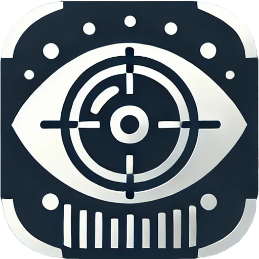
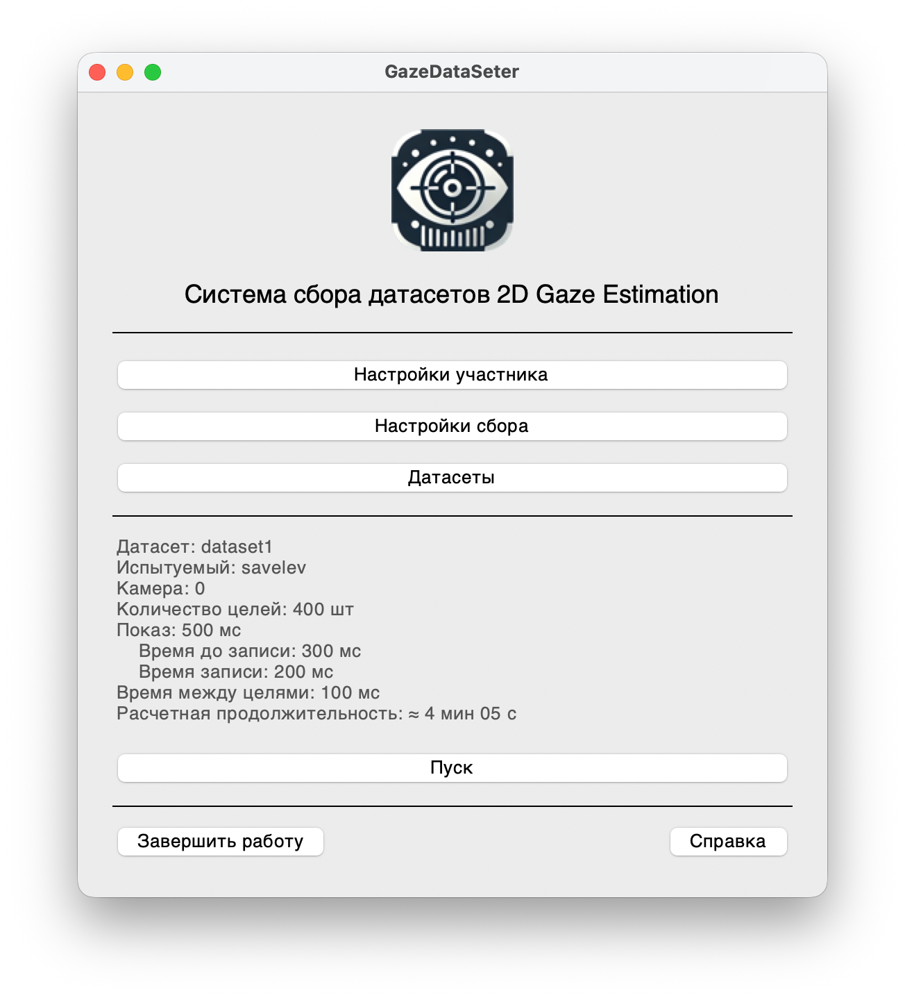
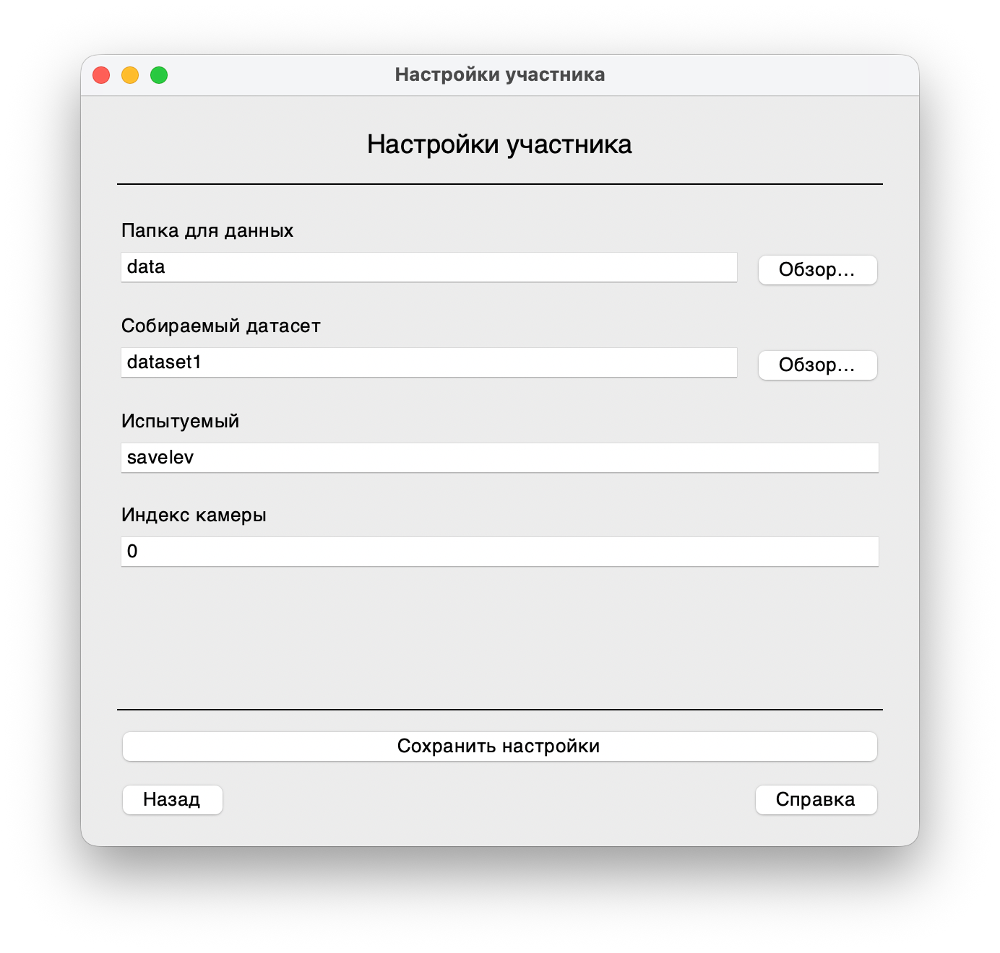
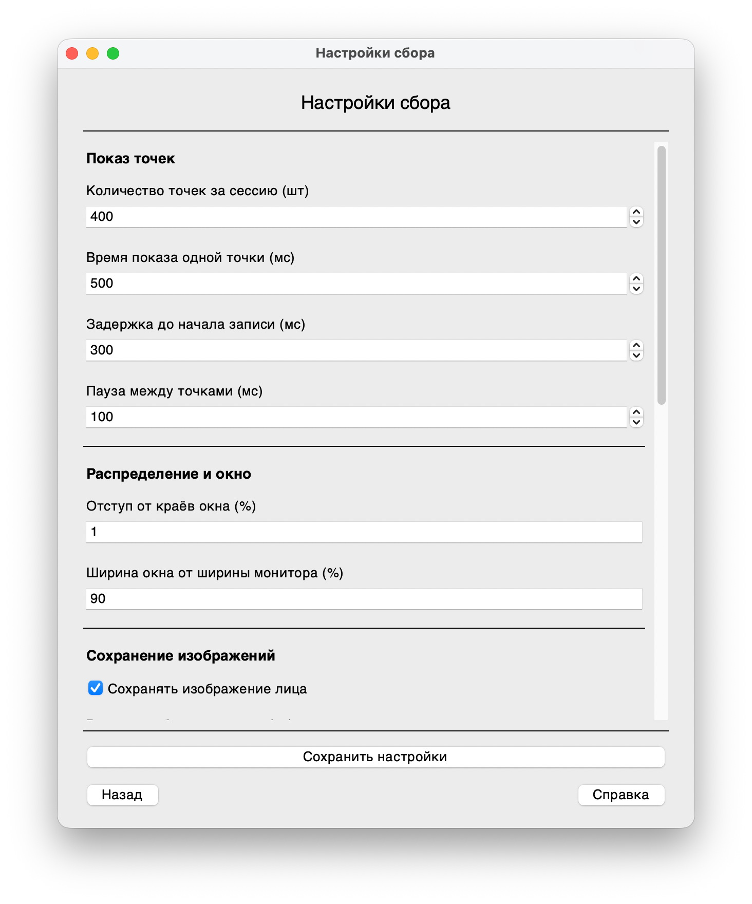
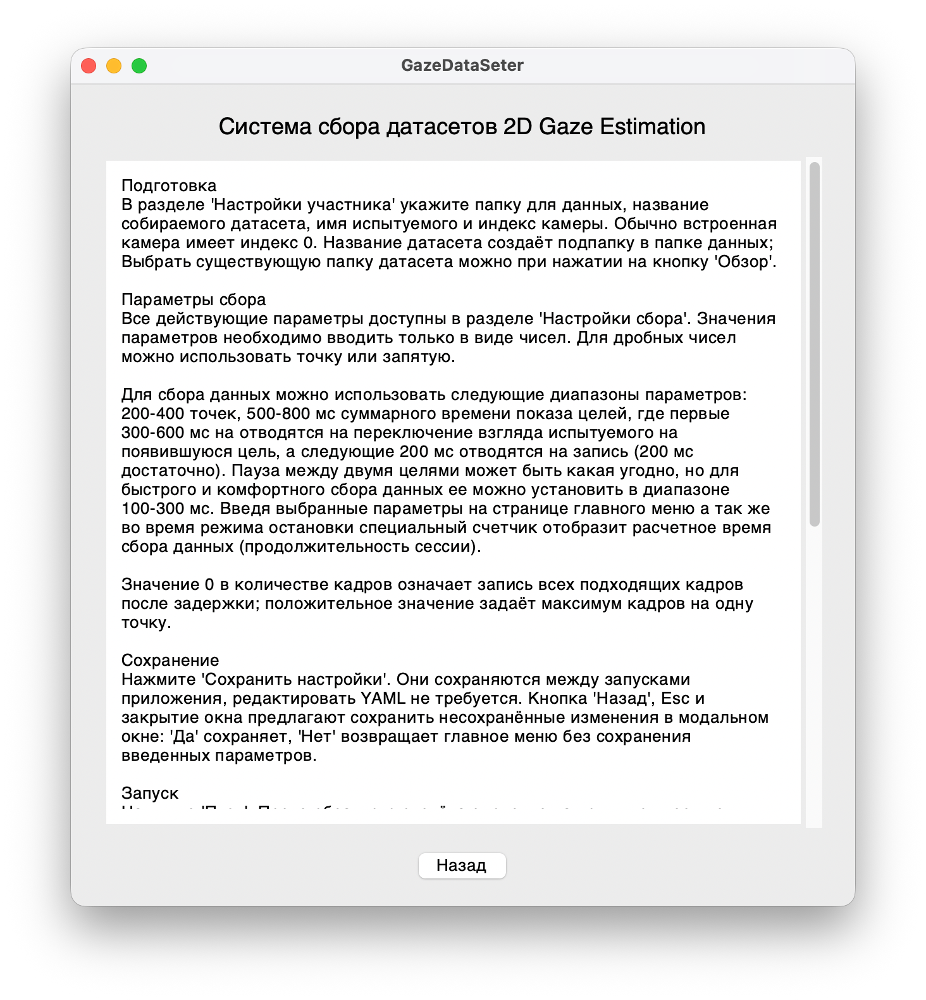
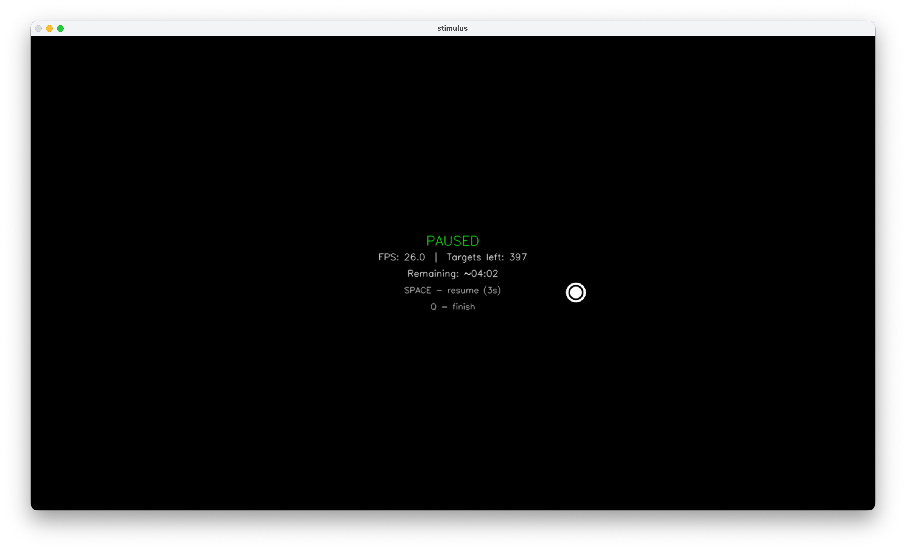
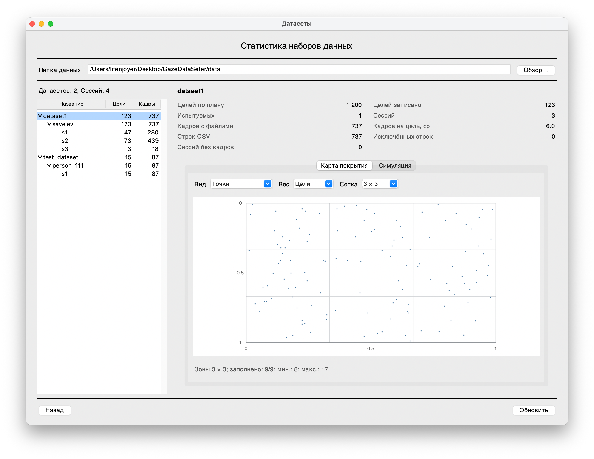
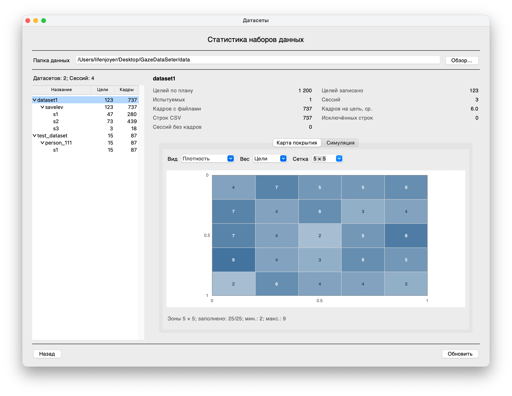
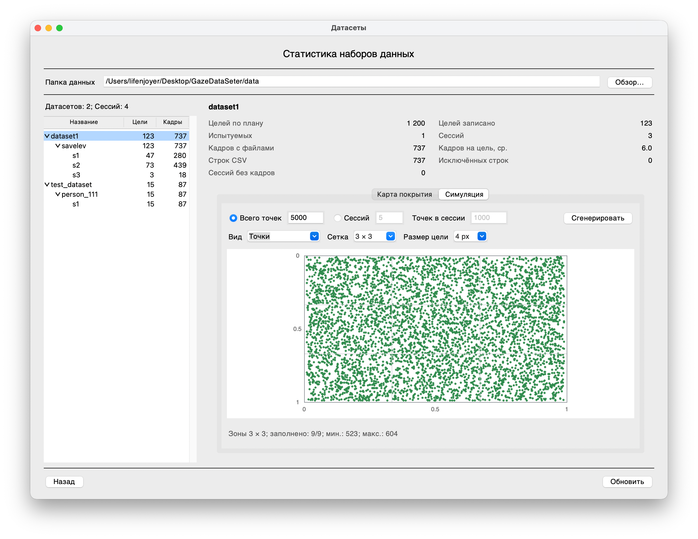
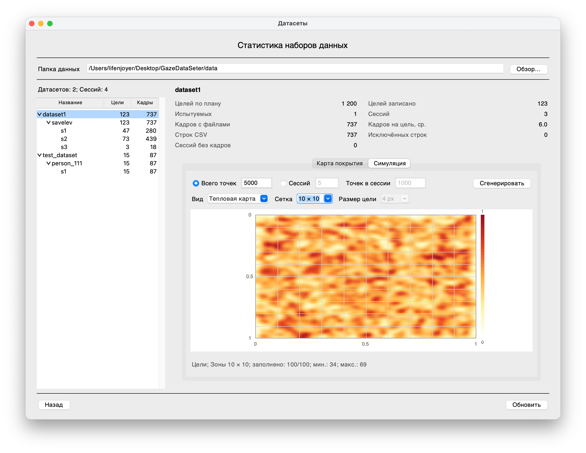

<div align="center">
<p>
    
</p>
<h1>GazeDataSeter</h1>
</div>
<div align="center">
<p>Десктопное приложение для сбора датасетов для обучения моделей рассчета взгляда пользователя на экране (2D Gaze Estimation tasks)</p>


</div>

## 🎯 Описание приложения для сбора датасетов

GazeDataSeter — приложение для сбора обучающих данных с обычной веб-камеры. Во время сессии на экране появляются цели. Испытуемый смотрит на каждую из них, а программа после заданной задержки сохраняет изображения лица и обоих глаз, углы головы и положение лица и глаз в кадре. Каждая запись содержит координаты соответствующей цели.

Датасеты предназначены для обучения мультимодальной fusion-модели: изображения лица и глаз можно обрабатывать отдельными нейронными сетями, а числовые данные — полносвязной сетью. Объединение их признаков позволяет обучать общую модель определения координат взгляда.

Качество разметки зависит от аккуратности испытуемого: координаты целей записываются при условии, что во время записи пользователь смотрит на них.

## 🌟 Возможности

- 🎯 **Сбор данных по случайно распределённым целям** с настройкой времени показа, задержки записи и паузы между целями
- 📷 **Сохранение изображений лица и обоих глаз**, углов головы и прямоугольных областей лица и глаз в кадре
- 🖥️ **Настройка всех параметров через интерфейс** с сохранением между запусками
- ⏸️ **Остановка и продолжение сбора** с сохранением текущей цели и обратным отсчётом перед продолжением
- 💾 **Хранение по датасетам, испытуемым и сессиям**, сохранение параметров запуска каждой сессии
- 📊 **Просмотр фактически записанных данных**: карта покрытия, плотность по зонам, тепловая карта и распределения по горизонтали и вертикали
- 🔍 **Симуляция распределения целей** для заданного количества точек или отдельных сессий

## 🛠 Установка

Для запуска нужен **Python 3.12** с модулем Tkinter. В Linux Tkinter может потребоваться установить отдельно средствами дистрибутива.

1. Клонируйте репозиторий:

   ```sh
   git clone https://github.com/savelevvaa/gaze-dataseter.git
   ```

2. Перейдите в папку с проектом:

   ```sh
   cd gaze-dataseter
   ```

3. Создайте виртуальное окружение.

   Для macOS и Linux:

   ```sh
   python3.12 -m venv venv
   ```

   Для Windows:

   ```powershell
   py -3.12 -m venv venv
   ```

4. Активируйте окружение.

   Для macOS и Linux:

   ```sh
   source venv/bin/activate
   ```

   Для Windows в PowerShell:

   ```powershell
   .\venv\Scripts\Activate.ps1
   ```

5. Установите зависимости:

   ```sh
   python -m pip install -r requirements.txt
   ```

MediaPipe закреплена на версии **0.10.14**: обработка лица использует `mp.solutions.face_mesh`.

## 🚀 Запуск приложения

Из папки проекта с активированным окружением выполните:

```sh
python app.py
```

Для работы с камерой разрешите приложению доступ к ней, если операционная система запросит разрешение.

### 🔧 Настройка и сбор данных

1. В разделе **Настройки участника** укажите папку для данных, название собираемого датасета, имя испытуемого и индекс камеры. Обычно встроенная камера имеет индекс `0`. Название датасета и имя испытуемого используются как названия папок.
2. В разделе **Настройки сбора** задайте количество целей и временные параметры, выберите сохраняемые изображения и остальные параметры записи. На Windows здесь также есть галочка **Использовать DirectShow**, по умолчанию включённая; при необходимости её можно снять.
3. Нажмите **Сохранить настройки**, затем **Пуск** в главном меню. После обратного отсчёта смотрите на появляющиеся цели.

По умолчанию сессия состоит из **400 целей**. Каждая показывается **500 мс**: первые **300 мс** отводятся на переключение взгляда, оставшиеся **200 мс** — на запись. Между целями предусмотрена пауза **100 мс**. С начальным отсчётом 5 секунд расчётная продолжительность составляет примерно **4 минуты 5 секунд**.

Значение `0` в максимуме кадров на точку означает запись всех подходящих кадров после задержки. Положительное значение ограничивает количество кадров; фактически их может быть меньше, если время записи короткое или лицо не обнаружено.

| Клавиша | Действие во время сбора |
| --- | --- |
| **Пробел** | Остановка после завершения текущей цели. Её данные успевают сохраниться |
| **Пробел при остановке** | Отсчёт 3 секунды и продолжение. Следующая цель остаётся видимой во время ожидания и отсчёта |
| **Q** или **Esc** | Завершение сессии во время сбора, остановки или обратного отсчёта |

Параметры сохраняются в `app_config.json`; редактировать YAML не требуется. При выходе через **Назад**, Esc или закрытие формы приложение предлагает сохранить изменённые параметры.

### 💾 Результат сбора

Каждый запуск создаёт новую сессию в выбранной папке данных:

```text
data/
└── test_dataset/
    └── person_111/
        └── s1/
            ├── face_images/
            ├── left_eye_images/
            ├── right_eye_images/
            ├── annotations.csv
            ├── session_config.json
            └── coverage_report.json
```

Папки изображений создаются для включённых видов записи. Одна строка `annotations.csv` связывает изображения одного кадра с координатами цели, углами головы, областями лица и глаз, временем и номером цели. В `session_config.json` сохраняются параметры запуска, версии библиотек и размеры камеры и окна.

### 📊 Просмотр датасетов

Кнопка **Датасеты** открывает окно-проводник. Выберите весь датасет, испытуемого или отдельную сессию: таблица и карта покажут данные выбранного уровня.

Количество записанных целей и кадров считается по `annotations.csv` с проверкой наличия непустых файлов изображений. Цели без записанных кадров не добавляются на карту. `coverage_report.json` описывает запланированное распределение целей и для фактической статистики этого окна не используется.

Во вкладке **Карта покрытия** доступны точки, плотность по зонам, тепловая карта и распределения по горизонтали и вертикали. Можно учитывать цели или кадры и менять сетку зон. Тепловая карта всегда строится по целям. При наведении отображается количество в выбранной зоне или интервале.

Во вкладке **Симуляция** можно задать общее количество точек либо количество сессий и точек в каждой. Здесь используется тот же генератор, что и при реальном сборе. Разбиение на сессии сохраняет равномерное распределение; конкретные координаты независимых запусков могут отличаться. Точки отображаются зелёным, их размер можно выбрать от 1 до 5 пикселей. Симуляция и просмотр датасетов не изменяют собранные данные.

## 📸 Скриншоты


Главное меню приложения | Настройки участника
:-------------------------:|:-------------------------:
 | 

Настройки сбора | Справка по работе приложения
:-------------------------:|:-------------------------:
 | 

Сбор данных | 
:-------------------------:
 

Датасеты: карта покрытия | Датасеты: плотность распределения
:-------------------------:|:-------------------------:
 | 

Карта покрытия синтетических данных | Тепловая карта синтетических данных
:-------------------------:|:-------------------------:
 | 

## 🤝 Вклад в проект

Буду рад новым идеям и предложениям! Открывайте issues и отправляйте pull requests.

## 📬 Контакты

По вопросам пишите на [savelevvaa@mail.ru](mailto:savelevvaa@mail.ru) или создавайте issue.
